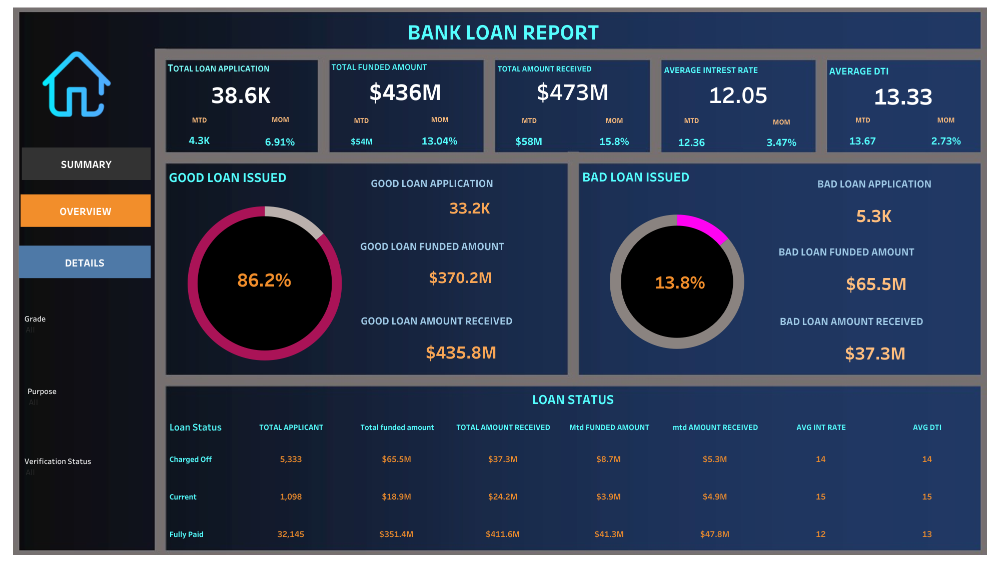

# Bank Loan Risk Analysis
*Analyzed 38.6K loan applications ($436M funded) to identify risk patterns and create interactive dashboards.*

---

## Overview
*This project explores bank loan applications to track good vs risky loans, monitor repayment trends, and support risk management decisions.*
*Through data cleaning, exploratory analysis, and Power BI dashboards, we highlight factors influencing loan defaults and strategies to reduce risk exposure.*

---

## Dataset
- Source: Bank loan application dataset  
- Records: 38,623 applications  
- Features: Applicant demographics, loan amount, tenure, purpose, property ownership, and loan status (good/risky)
## 📂 Dataset  

The raw dataset used in this project is available here:  
.csv)

---

## Tools & Technologies
- **Languages:** Python, SQL, Excel  
- **Libraries:** Pandas, NumPy, Matplotlib, Seaborn  
- **BI Tools:** Power BI  
- **Other:** Git, GitHub

---
## Key Metrics / KPIs
- Total funded: $436M  
- Good loans: 86.2% ($370M)  
- Risky loans: 13.8% ($65.5M)  
- 36-month loans performed best  
- Renters had higher default risk
- 
| Metric                      | Value      | Breakdown                          |
| --------------------------- | ---------- | ---------------------------------- |
| **Total Loan Applications** | **38.6K**  | Across multiple loan purposes      |
| **Total Funded Amount**     | **\$436M** | Issued to applicants               |
| **Total Amount Received**   | **\$473M** | Includes repayments                |
| **Good Loans**              | **86.2%**  | \$370.2M funded, \$435.8M received |
| **Risky Loans**             | **13.8%**  | \$65.5M funded, \$37.3M received   |
| **Average Interest Rate**   | **12.05%** | Slightly lower for good loans      |
| **Average DTI**             | **13.33**  | Higher in risky borrowers          |

---

## Approach
## 1️⃣ Data Collection
Gathered Bank Loan Application dataset (≈38.6K records).
Key attributes: Loan ID, Purpose, Grade, Sub-grade, Home Ownership, Loan Amount, Interest Rate, Installments, Loan Status, etc.

## 2️⃣ Data Cleaning & Preprocessing
Removed duplicates and missing values.
Standardized categorical values (e.g., Purpose, Grade).
Converted date fields (issue year, month) into time-series format.
Created new calculated fields:
Good Loan Flag (Fully Paid + Current)
Bad Loan Flag (Charged-Off)
DTI Ratio Buckets for segmentation.

## 3️⃣ Exploratory Data Analysis (EDA)
Univariate analysis: Distribution of loan amounts, terms, interest rates.
Bivariate analysis: Loan Status vs Home Ownership, Employment Length, Loan Purpose.
Trend analysis: Applications over time, state-wise disbursements.
Identified risk patterns among borrower segments.

## 4️⃣ KPI Definition
Total Funded Amount
Total Amount Received
Good Loan % vs Bad Loan %
Average Interest Rate
Average DTI

## 5️⃣ Dashboarding (Power BI)
Summary Dashboard → High-level KPIs (funded, received, interest rate, DTI).
Overview Dashboard → Applications by purpose, tenure, home ownership, employee length.
Details Dashboard → Loan status, good vs bad loan breakdown, regional trends.

## 6️⃣ Insights & Recommendations
36-month loans perform better than 60-month loans.
Renters & high DTI borrowers → higher chance of default.
Debt consolidation loans are the most reliable segment.
Recommendation: tighten approval for high-risk loan purposes (medical, small business, moving).

---

## Key Insights

### 1️⃣Loan Tenure:
36-month loans (73%) performed better than 60-month loans.

###  2️⃣Borrower Profile:
Applicants with 10+ years of work experience showed higher repayment rates.
Renters carried higher default risk compared to homeowners/mortgage holders.

### 3️⃣Loan Purpose:
Debt consolidation & credit card loans dominate applications.
Risky loans are more frequent in small business, medical, and moving expenses categories.

### 4️⃣Geography:
Loan applications are concentrated in a few states; repayment rates vary regionally.

### 5️⃣Status Breakdown:
Fully Paid: 32K+ loans ($351M funded).
Charged-Off: 5.3K loans ($65M funded → $37M recovered).
Current: ~1.1K loans still active.

---
## 📊 Dashboards  

###  Summary Dashboard  

### Overview Dashboard
  
### Details Dashboard

---
## Conclusion & Recommendations
The analysis of 38.6K loan applications ($436M) shows that while 86% loans are good, about 14% ($65M) are at risk.

### Key Insights:
36-month loans perform better than 60-month loans.
Renters have higher default risk compared to homeowners.
Certain purposes (e.g., small business, debt consolidation) are riskier.

### Recommendations:
Promote shorter loan tenures (36 months).
Apply stricter checks for renters.
Adjust interest rates based on risk profile.
Continuously monitor portfolio performance via dashboards.

---

